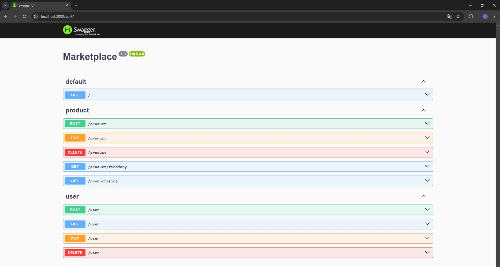
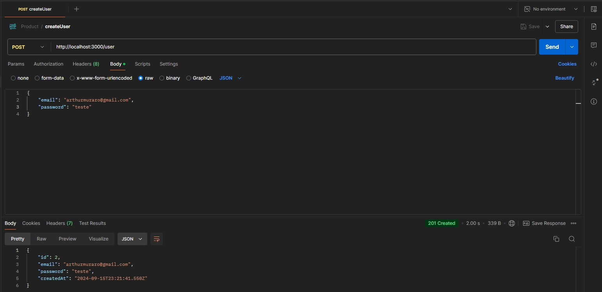
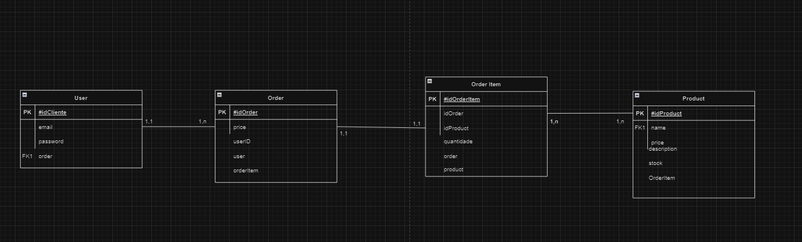
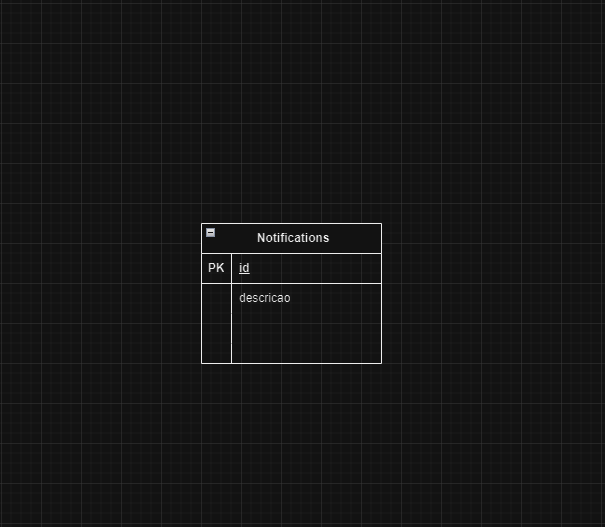
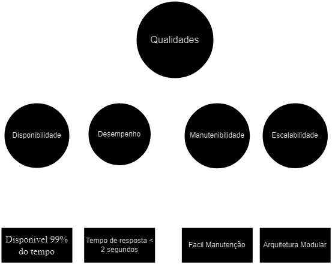

Integrantes do Grupo: Arthur Muraro, Clovis de Mello, João Antonio Lopes, Murilo Baduy e Guilherme Rouver

Links para a entrega do TDE 2

Repositório GitHub com Backend:
https://github.com/agmuraro/Marketplace-Cloud

Repositório GitHub com Azure Functions:
https://github.com/agmuraro/FunctionNotification

Evidência DockerHub:
https://hub.docker.com/r/arthurmuraro/marketplace-cloud

Azure Function Links:
https://notificationcrud.azurewebsites.net
https://notificationcrud.azurewebsites.net/api/createNotification?
https://notificationcrud.azurewebsites.net/api/getNotification?
https://notificationcrud.azurewebsites.net/api/updateNotification?
https://notificationcrud.azurewebsites.net/api/deleteNotification?

TDE 3

REPOSITORIO MICROSSERVIÇO
https://github.com/agmuraro/Marketplace-Cloud

REPOSITORIO BFF
https://github.com/joaolopes21/ecommerce-bff

REPOSITORIO AZURE FUNCTIONS
https://github.com/agmuraro/FunctionNotification

Link container bff
https://bffcontainer.internal.livelyforest-7ff538b4.brazilsouth.azurecontainerapps.io

Link container microsserviço
https://microcontainer.livelyforest-7ff538b4.brazilsouth.azurecontainerapps.io

Links das filas do Service Bus
https://TrabalhoCloud.servicebus.windows.net/filaproduto
https://TrabalhoCloud.servicebus.windows.net/filadelete
https://TrabalhoCloud.servicebus.windows.net/filaget
https://TrabalhoCloud.servicebus.windows.net/filaput

# ARC42 

# 1 - Introduction and Goals

O sistema Sublime Co. será uma plataforma web de e-commerce focada em vestuário com ênfase em moda streetwear. Seu principal objetivo é democratizar o acesso a esse estilo, tornando-o disponível para um público mais amplo. O projeto tem como visão oferecer uma experiência de compra fluida e moderna que combine a essência da moda urbana com facilidade de navegação e acessibilidade.

O Sublime Co. busca atender às necessidades de usuários de diferentes perfis permitindo a personalização da experiência e disponibilizando coleções exclusivas, além de oferecer funcionalidades de recomendação baseadas em preferências e histórico de navegação. A plataforma deverá ser escalável para atender a uma grande quantidade de acessos simultâneos e também adaptável para atualizações e novos lançamentos de coleção.
# 1.1 - Requirements Overview 

Este documento visa fornecer uma visão geral da arquitetura de um sistema de e-commerce de roupas, além de descrever a arquitetura do sistema, focando em sua escalabilidade e detalhando os componentes de suas interações. Desenvolvido para facilitar a compra e venda de produtos de moda online, o sistema será implementado utilizando NestJs para o backend, Prisma ORM para o gerenciamento do banco de dados e Azure para hospedagem e escalabilidade.

O objetivo é criar uma plataforma de e-commerce eficiente, escalável e segura, que permita aos usuários uma experiência de compra ágil e confiável, com suporte a altos volumes de transações e acessos simultâneos.

# 1.2 - Quality Goals 

Os principais objetivos de qualidade para o sistema incluem:

1. Disponibilidade: Manter o sistema disponível para os usuários a todo momento.
2. Desempenho: Garantir que o tempo de resposta das operações seja inferior a 2 segundos.
3. Segurança: Proteger os dados dos usuários.
4. Escalabilidade: Suportar o aumento no número de usuários de forma eficiente.
5. Manutenibilidade: Facilitar a manutenção e atualização do sistema através de uma arquitetura modular.

# 2 - Architecture Constraints 

# 2.1 - Technical Constraints 

As principais restrições técnicas do sistema incluem:

1. Escalabilidade: O sistema deve ser capaz de lidar com um número crescente de usuários sem perda de desempeno.
2. Segurança: O sistema deve proteger os dados dos usuários.
3. Desempenho: O tempo de resposta deve ser rápido o suficiente para garantir uma boa experiência ao usuário.
4. Compatibilidade: O sistema deve funcionar bem em diferentes dispositivos e navegadores.
5. Implementação NestJs: O projeto deve ser implementado em Nestjs.

# 2.2 - Organizational Constraints 

As principais restrições organizacionais incluem:

1. Prazos: O projeto deve ser concluído dentro dos prazos definidos pelas entregas.
2. Equipe: Cada membro da equipe terá sua função dentro do projeto.
3. IDE do projeto: O projeto deve ser desenvolvido utilizando o Visual Studio Code.
4. Versionamento: Repositório público no Github e utilização de Git.

# 3 - System Scope and Context 

# 3.1 Business Context 

O sistema de e-commerce de roupas permite que os usuários comprem produtos de moda online. Ele inclui funcionalidades como gerenciamento de produtos, carrinho de compras, processamento de pedidos e pagamentos online.

O modelo de negócios é baseado na venda de produtos de moda, com o sistema suportando diferentes métodos de pagamento.

1. Usuários: Navegam pelos produtos, adicionam itens ao carrinho e realizam compras.
2. Administradores: Gerenciam o catálogo de produtos, preços e promoções.
3. Sistema de Pagamento: Processa transações financeiras de forma segura.
4. Diagrama C4 Model Nível 1.

# 3.2 - Technical Context 

O sistema é composto pelos seguintes componentes técnicos:

1. Back-end Nest**: Responsável pela lógica de negócios e gestão de dados.
2. Prisma ORM: Facilita a interação com o banco de dados hospedado na Azure.
3. Banco de Dados na Azure: Armazena dados dos usuários, produtos e transações.
4. API REST: Fornece uma interface para comunicação entre o front-end e o back-end.
5. APIs de Terceiros: Integração com gateways de pagamento.
6. Front-end: Html,Css, JS: Responsável pela visualização do sistema para o usuário 
7. Diagrama C4 Model Nível 2

![](https://mermaid.ink/img/pako:eNqtV91u2zYUfhWCVxngpPXf7PguTuotQ1O4cYICg4HhWGJcbhKpklRaO_XDFLsYttuiT-AX2yH1L8uJu0ywDemco4_n9yP9QD3pMzqi571zKQxwwdRcELwMNwEj570r1AfkDb_H3w45JrN4EfCQnXhyLhLLKVNaiqNYx6C4bJE5vdXx9gveE18SduzJMGTKY3Na173KVORDzMg9R4SAr4EwgopIAYmU9GMj9Zz-kK02W2nDwt_GMhY-qNWR5vYZcii7xiyREZ8VSyAEeUgg7JVHWyDdKZS9En4msEgTK2PCr71dQTj6yBZnUWTN37EFwdsk0vQh4B4YLkUiPFvHihXvFtZTJTEBaAfESB80wc9dLDwrCbgPPtPEBxLI3zEtgLmRmsRpLpP8ZI5tslTtiRMiXg5xDN4fT0V4Nr1cgmEfYTWeTFwY00vyUyJ5gaI0tkKYCK6ZzxVzIdhwFPsQY4jbv7bfMBgXhAcYU8g9JTVT96iSpVJnV-65M5xZQ09eYlm0XeTKCo-z123NnaohnmpMugmnAebRql0zHUmht1_seEQskGTJFMOqQciEwe4ni1h7rhN56tUjPl0sjhYgSj4l687evk5WG1ulxcJ2wPIXoM5WhbBmmOlUiV-nzbpmZ-nNQXm-USA0eLaDm7NtnAEW9U95aM6bMPdCPiv_ZTBsusPSX3dPiqW8GO8rQRW_qRLY-o86sb8QYOOeIAtYX8pD6xSOH6yGgM3HE7mvYBVJzSTlRNdkJqVlQJoGYRwZ2cgzdsbB1gYVONQsRIVhKuQCY7cNGP7HvrtNtpM9I35bYr6DWm4Hbg_ac7stp-QWgRjHzyD7u0ZGKkCBVJjIbFYOaMWy20-SQVwLY5cQcovHSKF2m5frmgXFJl_sebeGu-5wfJ7lQ6U7OHZEsa-rMl39fHMznb2wv7kPdoEMd2fHmcAaDeobSIHloGYVrBpGQyeUN6gqXINrzXA5V_8PWDXi-S7EJoidkb9RfIklsk1Etn_j3Lq64KBCtP2qs1MXQhFIh95PC5s9qxoLZDPujl2Imq5Qca3mRj1xtrLF0QAnpShnfe19K-9pgJ2K78zU6-0_2KFMe4rdp5NUR_z8Btntl0bgNITqnv08yEr9mnaj74KnLYqH3xC4j0d8R5Nzat6zEE_DI7z12R3EgZnTudigqeWn2Up4dGRUzFpUyXj5no7uIND4FEc-duwFh6WCMDOJQPwqZZgb4TMdPdBPdHTcOR2c9NrDQbd92v2x0-_2W3SF4vagfzIY9geDzqDTHg57w-6mRdcOo3PS6_Z73ZenndPesNNr21dwBJA0r5I_Ke6_yuZf76FEVw?type=png)

# 4 - Solution Strategy
A estratégia de solução para o projeto 'Sublime Co.' envolve a criação de uma plataforma de e-commerce robusta e escalável. A abordagem principal é adotar uma arquitetura modular e baseada em microserviços, utilizando o NestJs para o desenvolvimento do backend, Prisma ORM para gerenciamento de banco de dados e Azure para hospedagem e escalabilidade. A solução visa garantir que o sistema seja eficiente, seguro e de fácil manutenção.

1.  Technology Stack
Backend: NestJs
ORM: Prisma ORM
Banco de Dados: SQL Server e MongoDB Atlas
Hospedagem e Escalabilidade: Azure
Frontend: HTML, CSS, JavaScript

2.  Design Principles
Modularidade: Dividir o sistema em módulos independentes para facilitar a manutenção e escalabilidade.

3. Segurança: Implementar práticas de segurança rigorosas para proteger dados dos usuários e transações.

4. Desempenho: Garantir tempos de resposta rápidos e alta disponibilidade.

5. Escalabilidade: Adotar soluções que suportem o crescimento do número de usuários e transações.

# 5 - Building Block View

# 5.1 - Whitebox
![](https://mermaid.ink/img/pako:eNqlV81u2zgQfhVCpxRwUttxfupb6my7LbaJN05QYOHLWBo7BCRSJalsnCAPU-yhpz0V-wR-sQ5JSaZsp7G3vlgczsz36RtySD1GsUww6keD3kAKg_dmLBj9DDcpshHXBjNgCbLf9mOZZahiZPvsnMNMgZ8YyCyXAilWj4UPHqLSUuwVGlWLjaMbXSy-Ki7ZWZ7yGBbfFv9I9hkn48jOfqBIBTNklJ9JpkvIOw6M26kpEOTf1vtVld8yBS5Q7ZHd5vCJDZeCDSmVTzziYkbvYA2EXHsEqC51DgqY1KwoWWoPCzOuMGuSOnAcmgwg5w6smKQ8w8ElOxt-8BAXqM3H0evreY6jWPHceDPNs5jkUpCyLwWylCfgYICli-8zYmlVFThbfI9Js-Sn6LniOoNByimhTT4Mxh7OW9jl1Sc_LqtMiYFBUI8ZKhQxt1QE3i_-Q82QyZyEoHk7ckpoNgER0x9RTCChB4UpEE8BXB9sKtH5ZE9_Sc9dmUZ__sHOwcAEdFUjsoxQ3aEqxVEZPKCAMjkpqApTKDtoWQaSijOV5FSSInWquhHdXMmkMFJvUIpoZFLMpCfyyT2-ZWcmBe2RS9NGGhmKFTIEphBS_gBsUugYyIcEYNOUpPv3DptavJWFSEDN90hao2SaoqpMVUW8lai8Yo8-yLMvt9aee7PYLF19aZ2RLa2e_fuqlGH56jolRBY2SNUEtHu3iXZDlv8FVW-s57Agz5tQtFu3Q6JFa2VvLuUlzNNaBegd7niMofwjb3pR-9IvFL40lQsIBM-LdOMu1r7LbCN6AOMU3xVjG7UDDCt1A-KdVAKpLTqlFt9kLbLLvrXQCnOpuZFqHmp9VVn5y3pb31DsOna-8dxwfWnZlnxXD5ZKglvJX6E67X8dcptqVJC2FL-IuPN-gIdC4btCxGGVzqyRWas9L58vlAseUB80bin5pzqu7KSNXJ4xHYag2IU0fOo5EvVn9bHx79H4FmC2yK4wLqwkOyGcY4r-LfzTFjiJddwN5SZPSq380xYoYAp3zDyPUxf1CtPyylXeim401F520pnL-woxK4TtIPae9fv19fD1x9HlRXBo2QDnu_HouZIGgY5FIxsILmD96PiZ91rzX3Feum8gst6aB7d0LW2grNJZabLrASuMmv1y6b5GrPZaaWCrZWgQaPacNSK1X9AnKrfAMdyIq1fCsIU009dba7eQaq_sFlWt_RejQl1D1_oWScXB2MC-RgbNBdUMCO57qyFRK6JPGbqyJfTl43rbODK3mNEZ2KfHBKdQpHSBHosncgU6NEZzEUd9ugBiK1KymN1G_SmkmkaFe7Hyi6i25iD-kjKrQmgY9R-j-6i_f9o-OGkft9-0j3ud48N2txXNo_6b7kHnqG0NnU7vtHvUe2pFDy6-c3By3O2dHB6dHna7nR79P_0AY_W_tQ?type=png)

# 5.1.1 - API 
- API central que lida com a lógica de negócios do sistema.
Interfaces: Comunicação via HTTP/JSON com o frontend e com o banco de dados.
Responsabilidades: Gerenciamento de usuários, produtos

# 5.1.2 - PrismaClient 
- ORM para interação com os bancos de dados.
Interfaces: Conecta-se ao SQL Server e ao MongoDB Atlas.
Responsabilidades: Facilitar operações CRUD e consultas complexas.

# 5.1.3 - SQL Database 
- Banco de dados relacional para armazenar dados estruturados.
Interfaces: Conectado ao PrismaClient.
Responsabilidades: Armazenar informações de usuários, produtos e transações.

# 5.1.4 - MongoDB Atlas 
- Banco de dados NoSQL para armazenar dados não estruturados.
Interfaces: Conectado ao PrismaClient.
Responsabilidades: Armazenar dados de produtos e buscas flexíveis.

# 5.2 - Building Blocks - Level 2

# 5.2.1 - API 
Controladores:

ProductController: Gerencia operações de produtos.
UserController: Gerencia operações de usuários.
AppController: Gerencia operações gerais.
Serviços:

ProductService: Manipula lógica de negócios para produtos.
UserService: Manipula lógica de negócios para usuários.
AppService: Fornece serviços gerais para a aplicação.
Repositórios:

ProductRepository: Interage com o banco de dados para produtos.
UserRepository: Interage com o banco de dados para usuários.
AppRepository: Interage com o banco de dados para operações gerais.

# 5.2.2 - PrismaClient 
Responsabilidades: Gerenciar conexões e operações com os bancos de dados.
Interfaces: Conecta-se ao SQL Server e ao MongoDB Atlas.

# 5.2.3 - SQL Database 
Estrutura: Tabelas para usuários, produtos e transações.
Interfaces: Acesso via PrismaClient.

# 5.2.4 - MongoDB Atlas 
Estrutura: Coleções para produtos e buscas.
Interfaces: Acesso via PrismaClient.

# 6 - Runtime View

# 6.1 - Creating New Users
- Processo de criação de novo usuario no sistema.
Fluxo: a API processa a solicitação e interage com o banco de dados para armazenar os dados.

)

- Processo de criação de nova notificação através de Functions.
Fluxo: As Azure Functions solicitam e interagem com o banco de dados para armazenar os dados.

# 7 - Deployment View
- Representação de como os componentes serão implantados em ambiente de produção.

Componentes:
1. Azure: Hospeda o banco de dados da aplicação.
2. Docker: Contêineres para ambientes de desenvolvimento e produção.
3. GitHub: Versionamento e controle de código-fonte.

# 8 - Concepts

# 8.1 - Domain Models
- Modelos que representam as entidades principais do sistema, como Usuário, Produto e Pedido.

 | Tabela  | Descrição |
|-------------|-------------|
| Endereco     | Armaneza o endereço do cliente, composto pelo CEP, numero, Complemento, Cidade, Estado e Rua.      |
| Pedido      | Armaneza a data, o preço, o desconto, e o preço final do pedido realizado |
|Produto      | Armaneza o preço final, preço custo e a descrição do produto |
| Cliente     | Armaneza email, telefone e data de inscrição do cliente |
| Forma_Pagamento  |  Armaneza descrição do pagamento
| Categoria  |  Armaneza descriçao da categoria

- Modelo DER do MongoDB

 | Tabela  | Descrição |
|-------------|-------------|
| Notifications     | Armaneza o id e descrição da notificcação     |

# 8.2 - Persistency
- Estratégias de armazenamento de dados, incluindo uso de SQL Server e MongoDB.

# 8.6 - Session Handling
- Gerenciamento de sessões de usuário para manter o estado entre requisições.

# 8.8 - Safety
- Garantias de que o sistema opera sem falhas que possam comprometer a integridade dos dados.

# 8.10 - Plausibility and Validity Checks
- Validação de dados para garantir a consistência e integridade.

# 8.11 - Exception/Error Handling
- Mecanismos para tratar e registrar erros e exceções.

# 8.13 - Configurability
- Facilidade de configurar parâmetros e ajustes do sistema.

# 8.15 - Migration
- Estratégias para migração de dados e versões do sistema.

# 8.17 - Build-Management
- Processos para construção e empacotamento da aplicação.

# 9 - Design Decisions

# 9.1 - Decisão sobre a estrutura da base de dados
Problema:
O sistema precisa lidar com um volume alto de dados, tanto estruturados quanto não estruturados (dados de usuários, produtos e buscas), mantendo um desempenho rápido e garantindo a segurança e integridade dessas informações.

Alternativas consideradas:

Usar SQL Server para o armazenamento geral, centralizando todos os dados no mesmo lugar.

Usar uma abordagem mista, com SQL Server pra dados de usuários e transações, e MongoDB pra armazenar dados de produtos.

Decisão:
A opção escolhida foi usar só o SQL Server pra todas as operações de armazenamento. Isso significa que tanto os dados de usuários, produtos e transações vão ser gerenciados no SQL Server, usando o Prisma ORM pra facilitar a comunicação e persistência dos dados.

Justificativa:
Centralizar tudo no SQL Server irá simplificar a infraestrutura e reduzir a complexidade de integração e manutenção. O SQL Server possui suporte para trabalhar com dados semi-estruturados, garantindo flexibilidade sem comprometer a consistência. Além disso, essa escolha garante que o sistema vai ter a escalabilidade e a performance que necessita para funcionar sem problemas.

# 10 - Quality Scenarios

# 10.1 - Quality Tree

# 10.2 - Evaluation Scenarios
| Qualidade  |  Descrição |
|-------------|-------------|
|Usabilidade | Facilidade De Uso 
|Disponibilidade | O site deve estar disponivel 99% do tempo
| Desempenho  | O site deve ter um tempo de resposta menor de 2 segundos em media
| Manutenibilidade | O site deve ser simples de realizar manutenção 
| Escalabilidade | Deve ser possivel adicionar mais categorias de compra, produtos etc.

# 10.3 ATAM - Architecture Tradeoff Analysis Method
Cenário 1: Escalabilidade e Desempenho durante Picos de Acesso
Cenário: Em datas especiais, como a Black Friday o e-commerce experimenta um aumento significativo no tráfego, necessitando de uma infraestrutura que suporte altos volumes de acessos sem queda de desempenho.

Atributos de Qualidade (ISO 25010:2023):
Eficiência de performance: Tempo de resposta de páginas e transações deve ser rápido (menor que 2 segundos).
Usabilidade: Disponibilidade de 99% durante picos de acesso.

Decisão Arquitetural:
Utilizar uma arquitetura baseada em microsserviços, hospedada em uma infraestrutura de cloud computing com escalabilidade automática (auto-scaling) para balanceamento de carga e otimização de performance.

Trade-offs:
Maior capacidade de resposta durante picos de uso, porém um custo elevado com serviços de cloud computing durante esses picos e maior complexidade na gestão e monitoramento.

Resultados: 
Com a escalabilidade automática, o sistema consegue lidar com picos de acesso sem quedas de desempenho, atendendo a demanda sazonal de maneira eficiente, mas com um custo operacional maior durante esses períodos.

Cenário 2: Segurança e Privacidade dos Dados do Cliente
Cenário: Como o e-commerce armazena dados sensíveis dos usuários, como informações pessoais e de pagamento, a proteção contra ameaças de segurança e vazamento de dados é essencial para proteger a privacidade dos clientes.

Atributos de Qualidade (ISO 25010:2023):
Segurança: Dados sensíveis dos clientes devem ser protegidos por meio de criptografia, autenticação forte e controles de acesso rigorosos.

Decisão Arquitetural: 
Implementação de autenticação multifatorial para administradores, criptografia de dados sensíveis com AES-256, além de controles de acesso baseados em funções (RBAC - Role-Based Access Control).

Trade-offs:
Garante a conformidade com leis de privacidade de dados como a LGPD, e aumenta a proteção dos dados sensíveis, porém autenticação multifatorial aumenta a complexidade de login para o usuário.
Resultados: A implementação de camadas extras de segurança protege os dados do cliente e contribui para a confiança na plataforma, embora possa diminuir a velocidade de login e encarecer a manutenção.

Cenário 3: Facilidade de Manutenção e Evolução da Plataforma
Cenário: O e-commerce precisa ser continuamente atualizado com novas funcionalidades, sem impacto significativo para os usuários finais.

Atributos de Qualidade (ISO 25010:2023):
Manutenibilidade: Facilidade para manutenção, atualização e integração de novos componentes.
Compatibilidade: Capacidade de integração com novos serviços e APIs, como sistemas de recomendação e motores de busca.
Decisão Arquitetural: Adotar uma arquitetura baseada em microsserviços e APIs, com contêineres para modularização e implantação contínua (CI/CD).

Trade-offs:
Facilita o desenvolvimento e atualização de componentes sem impactar o sistema, permitindo implantação modular de novas funcionalidades, porém requer uma infraestrutura complexa e ferramentas de gestão de microserviços avançada.
Resultados: A plataforma se torna altamente flexível e preparada para evoluir rapidamente com o mercado.

# 11 - Technical Risks
- Alguns dos riscos que indentificamos foram: 
1. O uso de várias tecnologias novas desconhecidas pela equipe pode levar a dificuldades técnicas na hora do desenvolvimento pela equipe
2. Gestão de Dependências e Integração de Terceiros: Dependências externas, como APIs de terceiros, podem ter problemas de disponibilidade
3. Problemas de Infraestrutura na Azure: Problemas de configuração ou falhas na plataforma Azure podem resultar em tempo de inatividade ou desempenho baixo, afetando a disponibilidade.

# 12 - Glossary
 | Term  | Descrição |
|-------------|-------------|
| Nest.JS     | Usado para realizar o desenvolvimento do back-end do projeto.      |
| Typescript      | Usado para realizar o desenvolvimento do back-end do projeto. |
|Mongo DB      | Usado para realizar o Armazenamento de dados das azure functions. |
| SQL SERVER (AZURE)     | Armazena dados estruturados, como informações do usuário e produtos. |
| Prisma ORM      | Contexto da aplicação que gerencia as conexões e operações com os bancos de dados relacionais. |
| Javascript      | Usado para realizar o desenvolvimento do Back-end das Functions Notifications. |
| Azure functions      | Usado para realizar o Envio de notificações das functions. |
| Vs Code      | IDE utilizada pela equipe para realizar o desenvolvimento do projeto. |
| DockerHub      | Usado para Hospedar o back-end do projeto desenvolvido pela equipe. |
| Github      | Usado para hospedar o codigo e realizar o versionamento do mesmo pela equipe.|
|     Swagger         |    Usado para documentar as API`s da equipe.    |

# Evidências:
microsserviço rodando e evidenciando que mandou mensagem para o service bus

Service bus

log da azure function disparando a function

Banco de dados mongodb salvando as notificações
